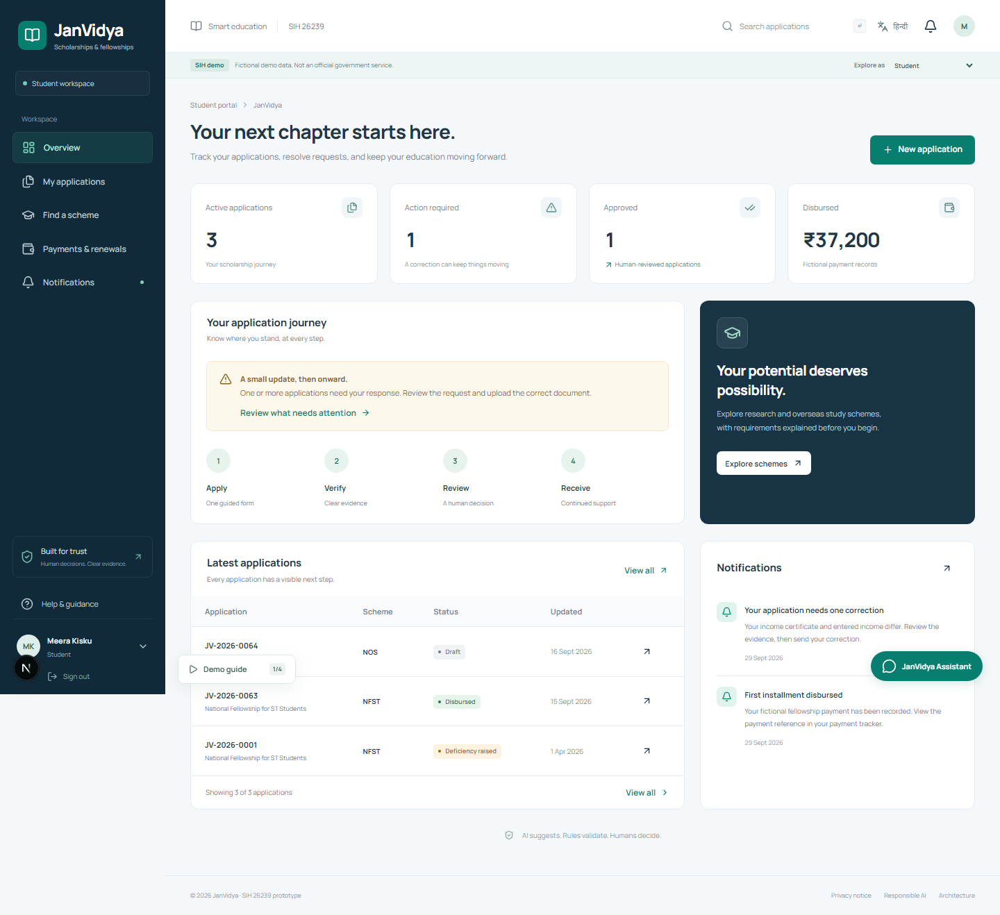
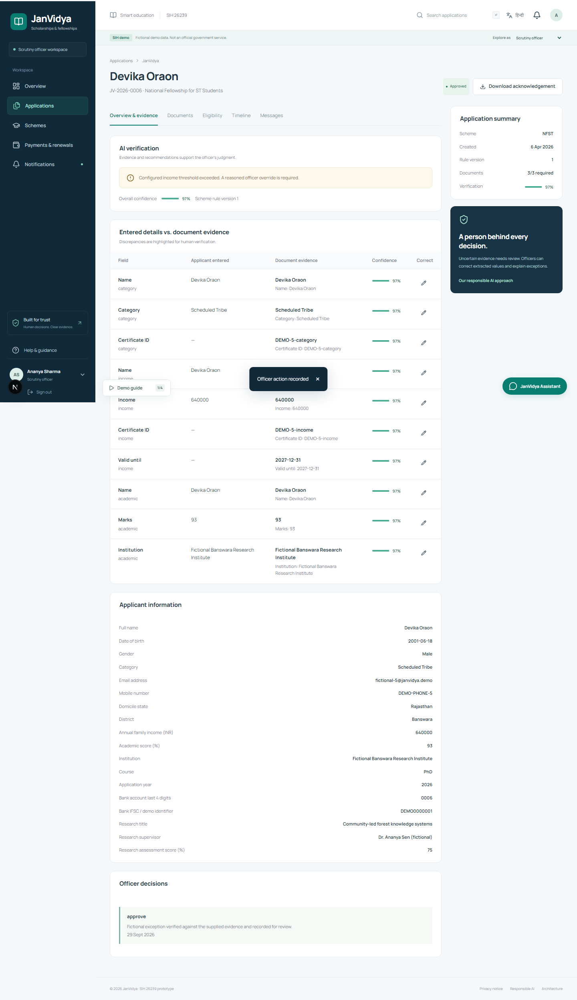
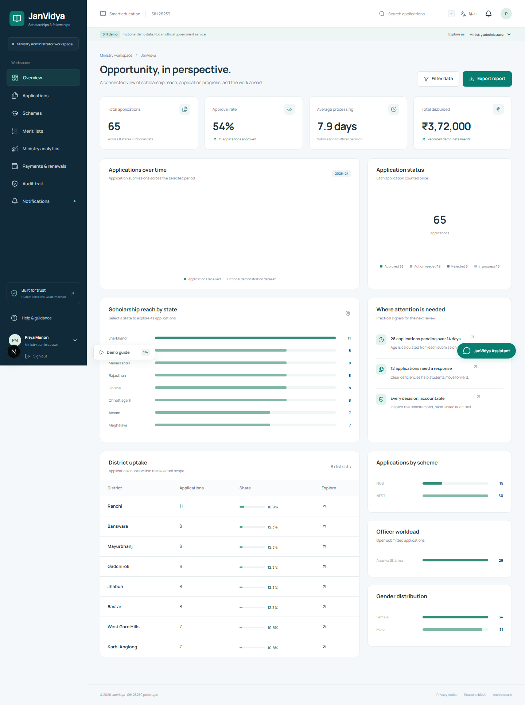
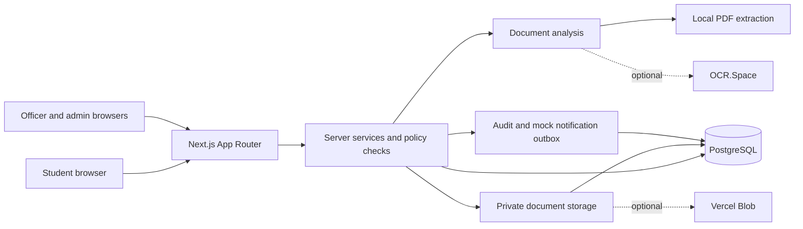
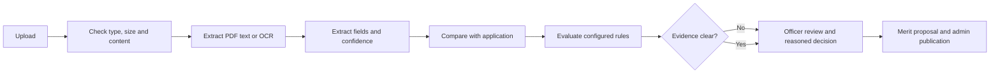

# JanVidya

**AI-enabled scholarship and fellowship management for Scheduled Tribe students**  
Smart India Hackathon 2026 · Problem Statement **26239** · Smart Education

JanVidya is an independent, fictional prototype for the Ministry of Tribal Affairs challenge. It connects applications, document checks, explainable eligibility, human scrutiny, selection, and post-award tracking in one accessible workspace. It is **not** an official government service.

## Problem and solution

Applicants repeat information across schemes and receive limited feedback when a document is missing or inconsistent. Officers must inspect large queues without a clear view of which cases need judgment. JanVidya gives students one account and a scheme-driven form; extracts evidence from documents; explains rule outcomes; routes exceptions to officers; and records each material decision. AI suggests, rules validate, humans decide.

## Screenshots

| Student                                                    | Officer                                                           | Ministry                                                       |
| ---------------------------------------------------------- | ----------------------------------------------------------------- | -------------------------------------------------------------- |
|  |  |  |

[Mobile workspace](docs/screenshots/student-mobile.png) · [Hindi workspace](docs/screenshots/student-hindi.png)

## Key features

- Four role-specific workspaces: student, scrutiny officer, scheme administrator, and ministry administrator.
- Registration and sign-in; scheme selection; versioned, configurable forms; draft autosave; acknowledgement PDF; timeline and messages.
- PDF/JPG/PNG validation, actual PDF text extraction, optional external OCR, extracted fields, confidence, mismatch and duplicate signals, and actionable deficiency notices.
- Configurable eligibility rules with field-level explanations. Low-confidence and conflicting evidence remain for human review.
- Officer decisions, reasoned overrides, versioned scheme configuration, quota-aware merit ranking, publication, and notifications.
- Mock payment ledger, progress reports, renewals, analytics with filters and CSV export, and a hash-linked audit log with verification/export.
- A guided SIH demo, local knowledge-base assistant, responsive layouts, keyboard-accessible controls, and English/Hindi page translation that preserves form input.

## Architecture



Next.js 16, React 19, TypeScript, Tailwind CSS 4 and custom CSS power the interface. Drizzle ORM handles PostgreSQL. Local development uses persistent embedded PGlite with automatic migrations and idempotent fictional seeding; production requires hosted PostgreSQL. The repository has 32 relational tables covering users, sessions, schemes, applications, evidence, reviews, selection, payments, renewals, notifications, and audit events.

`src/app` contains pages and route handlers. `src/components` contains the UI. `src/server` holds authenticated workflow services, document analysis, and queries. `src/lib` holds the deterministic rules and domain helpers. `src/db` and `drizzle` hold the schema and migrations. `tests` contains unit and browser flows.

## AI and document workflow



The local provider extracts text from real PDFs and uses deterministic document parsing. If no OCR key exists, images remain in manual review; they are never marked verified without evidence. An optional OCR.Space key enables image OCR and falls back to local extraction if the service fails. Confidence describes extraction quality; it is **not** a probability of fraud or eligibility. The local assistant uses a bounded knowledge base and does not call an external LLM. No external AI key is required for the complete fictional demo.

## Human decisions and rules

Schemes define fields, required documents, rules, ranking weights, overall/state quotas, and renewal thresholds. Application submissions retain a rule snapshot, so later scheme edits do not silently change an earlier decision. The rule engine returns pass/fail and a reason for each check. Officers can approve, reject, request clarification, raise a deficiency, escalate, or record an internal note. An approval with review flags requires an explicit reasoned override. Administrators review a proposed merit list before publication. Audit events store actor, timestamp, before/after context, and a linked hash; the UI verifies the chain. This detects changes to the stored sequence, but is not an external immutable ledger.

## Roles and demo accounts

| Role                   | Email                       | Demonstrates                                         |
| ---------------------- | --------------------------- | ---------------------------------------------------- |
| Student                | `student@janvidya.demo`     | Application, document correction, tracking, progress |
| Scrutiny officer       | `officer@janvidya.demo`     | Evidence comparison, deficiency, override            |
| Scheme administrator   | `schemeadmin@janvidya.demo` | Rules, quota, merit proposal and publication         |
| Ministry administrator | `admin@janvidya.demo`       | Analytics, audit, program oversight                  |

All four fictional accounts use **`JanVidyaDemo!2026`**. The `/demo` page switches roles without entering credentials when `DEMO_MODE=true`. Its 64 seeded applications include clean, deficient, duplicate-signal, low-confidence, approved, payment, and draft examples. `JV-2026-0001` shows correction; `JV-2026-0006` shows a reasoned override; `JV-2026-0064` is a student draft. Never use these credentials for real data.

## Run locally

Requires Node.js 22+ and npm. No external database or API key is needed.

```bash
npm ci
cp .env.example .env.local
npm run dev
```

Open `http://localhost:3000`, then `/demo`. The first server request creates `.data/postgres`, runs migrations, and seeds fictional records. `npm run seed` is idempotent: it adds initial data only to an empty database and preserves existing records. `npm run db:migrate` applies migrations. For a fresh local demo, stop the server and run `npm run demo:reset`. It moves the prior embedded database to `.data/backups` before recreating fictional data, refuses hosted databases, and has no production endpoint.

```bash
npm run typecheck
npm run lint
npm test
npm run test:e2e
npm run build
```

The Playwright suite starts its own local server and isolated fictional database. It checks cross-role workflows, OCR fixtures, autosave, overrides, merit, analytics, registration, mobile overflow, and full-page Hindi translation.

## Environment variables

| Name                                                            | Local default           | Purpose                                                                                                                     |
| --------------------------------------------------------------- | ----------------------- | --------------------------------------------------------------------------------------------------------------------------- |
| `DATABASE_URL`                                                  | empty                   | Required hosted PostgreSQL URL on Vercel; use a pooled connection.                                                          |
| `DATABASE_URL_UNPOOLED`                                         | empty                   | Optional direct URL used by migration/seed scripts.                                                                         |
| `DEMO_MODE`                                                     | `true`                  | Enables demo accounts, fixtures, and role switching. Set `false` for non-demo use.                                          |
| `STORAGE_PROVIDER`                                              | `database`              | `database` stores private bytes in PostgreSQL; `vercel-blob` uses private Blob storage.                                     |
| `BLOB_READ_WRITE_TOKEN`                                         | empty                   | Required if `STORAGE_PROVIDER=vercel-blob`.                                                                                 |
| `OCR_SPACE_API_KEY`                                             | empty                   | Optional external OCR; local PDF extraction/manual review works without it.                                                 |
| `APP_URL`                                                       | `http://localhost:3000` | Public origin for production HTTPS cookie/origin settings.                                                                  |
| `AI_PROVIDER`, `OCR_PROVIDER`, `EMAIL_PROVIDER`, `SMS_PROVIDER` | `mock`/`local`          | Demo configuration labels. External LLM, email, and SMS integrations are not connected. Notifications use the local outbox. |

Copy `.env.example` and edit `.env.local`; both `.env.local` and `.data` are ignored by Git. Never commit connection strings, tokens, or real applicant documents.

## Deploy to Vercel

1. Create a Neon PostgreSQL database. Obtain a **pooled** URL for `DATABASE_URL` and a direct URL for `DATABASE_URL_UNPOOLED` if available. Do not use the embedded local database on Vercel.
2. Import this GitHub repository into Vercel as a Next.js project. Set `DATABASE_URL`, `DATABASE_URL_UNPOOLED`, `DEMO_MODE=true` for a private SIH demo, and `APP_URL` to its HTTPS production origin. Leave optional OCR and Blob credentials blank for the fallback demo. For private Blob storage, also set `STORAGE_PROVIDER=vercel-blob` and its token.
3. On a trusted machine, set the same database URLs in an untracked `.env.local`, then run `npm run db:migrate` and `npm run seed`. Seeding requires `DEMO_MODE=true`. It is idempotent and preserves records.
4. Deploy or redeploy in Vercel. Verify `/`, `/demo`, role sign-in, a student application, document fixture, officer review, `/merit`, `/analytics`, and `/audit`. Set `APP_URL` to the final domain and redeploy if the domain changed.

For real applicants, disable demo mode and provide an approved identity, storage, notification, security, and data-governance program before use. This prototype does not send actual payments or messages to external gateways.

## Security, privacy, and limitations

Passwords use scrypt; sessions are opaque, hash-only in the database, and stored in HttpOnly SameSite cookies. API routes enforce role and ownership checks, same-origin writes, validation, rate limits, and audit recording. Document downloads require authorization. File content/type and size are checked server-side. Audit rows are append-only at the database level and the chain can be verified. The prototype keeps only a bank account's last four digits.

All supplied records are fictional. Use no real sensitive data in the demo. The local PDF extractor reads text PDFs; scanned images need an external OCR provider or manual review. Payment, SMS and email actions remain fictional/outbox records. Rules and example amounts are configurable demonstration criteria, **not official policy**. Accessibility and security still require independent government-grade review before live use.

## SIH judge demo: three minutes

1. **0:00–0:30 — Student:** Open `/demo`, choose Student, show the scheme-driven form, autosave, and Hindi toggle.
2. **0:30–1:15 — Evidence:** Open `JV-2026-0001`, show its deficiency, upload clean fictional documents, and inspect extracted fields and confidence.
3. **1:15–2:00 — Officer:** Switch to Scrutiny Officer. Open `JV-2026-0006`, compare entered and extracted evidence, show the required reasoned override and audit entry.
4. **2:00–2:35 — Selection:** Switch to Scheme Administrator. Show configurable rules/quota, generate a merit proposal, confirm, and publish.
5. **2:35–3:00 — Oversight:** Switch to Ministry Administrator. Filter analytics, verify the audit chain, and ask the local assistant an eligibility question.

## Future scope

Potential integrations include official e-KYC, DigiLocker, PFMS/payment rails, ministry reference databases, approved SMS/email gateways, government SSO, expanded regional languages, NIC hosting, and independently evaluated fraud analytics. None is claimed as an existing integration.

## Team

Add your SIH team name, members, and contact details here before submission.
